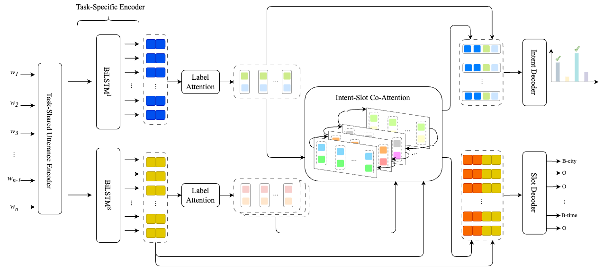

# MISCA: A Joint Model for Multiple Intent Detection and Slot Filling with Intent-Slot Co-Attention

We propose a joint model named MISCA for multi-intent detection and slot filling. Our MISCA introduces an intent-slot co-attention mechanism and an underlying layer of label attention mechanism. These mechanisms enable MISCA to effectively capture correlations between intents and slot labels, eliminating the need for graph construction. They also facilitate the transfer of correlation information in both directions: from intents to slots and from slots to intents, through multiple levels of label-specific representations, without relying on token-level intent information. Experimental results show that MISCA outperforms previous models, achieving new state-of-the-art overall accuracies of 59.1% on MixATIS and 86.2% on MixSNIPS.

<p align="center">	

</p>

**Please CITE** [our paper](https://aclanthology.org/2023.findings-emnlp.841) whenever our MISCA implementation is used to help produce published results or incorporated into other software.

    @inproceedings{MISCA,
        title     = {{MISCA: A Joint Model for Multiple Intent Detection and Slot Filling with Intent-Slot Co-Attention}},
        author    = {Thinh Pham and Chi Tran and Dat Quoc Nguyen},
        booktitle = {Findings of the Association for Computational Linguistics: EMNLP 2023},
        year      = {2023},
        pages     = {12641–-12650}
    }


## Model installation, training and evaluation

### Installation
- Python version >= 3.8
- PyTorch version >= 1.8.0

```
    git clone https://github.com/VinAIResearch/MISCA.git
    cd MISCA/
    pip3 install -r requirements.txt
```

### Training and evaluation
In our experiments, we train the base model without coattention first and initialize MISCA with this base model. In our experiments, MISCA was trained via 2 steps: freezing the PLM encoder, then fine-tuning the full model.
You can refer to the example [script](example_roberta.sh) (for PLMs) or [script](example_lstm.sh) (for LSTM).

We also provide model checkpoints of MISCA for MixATIS and MixSNIPS. Please [download](https://drive.google.com/drive/folders/1BdiXsokWZ8OzhvRf3mbJRGRPNNBjK4Rj) the checkpoint if you want to make inference without training from scratch. You can also use the base model provided here to train MISCA.
### Prediction
We provide a script to predict intents and slots from utterances. To run it, please prepare a raw text file with one utterance per line, and run the following command:
```
python predict.py --token_level word-level \
            --model_type roberta \
            --model_dir misca \
            --task <mixatis or mixsnips> \
            --data_dir data \
            --attention_mode label \
            --num_intent_detection \
            --use_crf \
            --intent_slot_attn_type coattention \
            --input_file input_file.txt \
            --output_file output_file.txt
```

### Acknowledgement

Our code is based on the implementation of the JointIDSF paper from https://github.com/VinAIResearch/JointIDSF

### Contact
If you have any questions, feel free to contact me (thinhphp.nlp@gmail.com).
